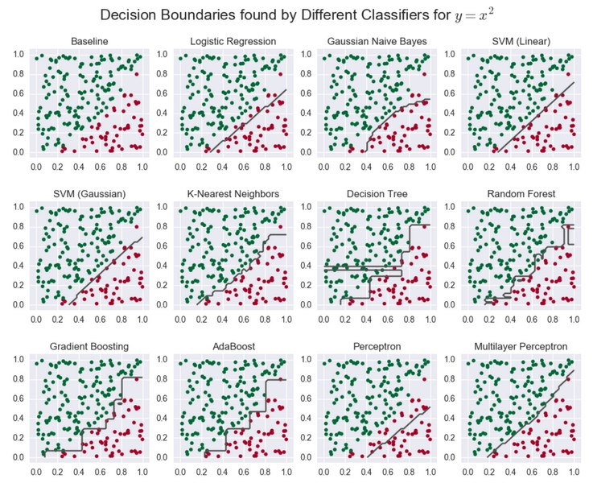

# Machine Learning

Some notebooks to supplement the [Machine Learning Engineer Nanodegree (MLND) from Udacity](https://www.udacity.com/course/machine-learning-engineer-nanodegree--nd009).

## Explorations

Exploration of some machine learning algorithms.

* [Regression](Regression/Regression.ipynb) - Exploring regression by attempting
to match a simple function, y = sin(x) - shows learning curves, complexity
curves, bias and variance.

* [Classification](Classification/Classification.ipynb) - Exploring
classification by attempting to find a simple decision boundary, y = x^2 -
compares several classifiers using different metrics - accuracy, F1, F1
weighted, MCC, precision, recall, and confusion matrices.

* [Clustering](Clustering/Clustering.ipynb) - Comparing the performance of
k-Means and Gaussian Mixture Model (GMM) Clustering on the labeled Iris dataset,
using the adjusted Rand score - GMM is better able to match the actual clusters.

<!-- ## Nanodegree -->
<!-- ### Project 0: [Decision Trees - Surviving the Titanic](Nanodegree/Project\ 0\ Titanic\ Survival/titanic_survival.ipynb) -->
<!-- Building a Decision Tree manually to predict who might survive the Titanic. -->
<!-- ### Project 1: [Regression - Boston Housing Market](Nanodegree/Project\ 1\ Regression.ipynb) -->
<!-- ### Project 2: [Classification - Student Success](Nanodegree/Project\ 2\ Classification.ipynb) -->
<!-- ### Project 3: [Unsupervised Learning - Customer Segments](Nanodegree/Project\ 3\ Unsupervised.ipynb) -->
<!-- ### Project 4: Reinforcement Learning -  -->
<!-- ### Project 5: Capstone -->

<!-- ## Resources -->

<!-- ### Sites -->

<!-- * [Machine Learning Mastery (Jason Brownlee)](http://machinelearningmastery.com/) -->
<!-- * [Data School (Kevin Markham)](http://dataschool.io/) -->
<!-- * [Scikit-Learn Notebooks (Jake Vanderplas)](https://github.com/jakevdp/sklearn_tutorial/tree/master/notebooks) -->
<!-- * [Data Science Notebooks (Donne Martin)](https://github.com/donnemartin/data-science-ipython-notebooks) -->

<!-- ### Nanodegree -->

<!-- * [Are Udacity Nanodegrees worth it?](https://www.quora.com/Are-Udacity-Nanodegrees-worth-it-for-finding-a-job) -->
<!-- * [MLND Slack channel](https://mlnd.slack.com/messages/general/) -->
<!-- * [MLND Wiki](https://github.com/machinelearningnanodegree/MLND/wiki) -->
<!-- * [MLND Support](mailto:machine-support@udacity.com) -->
<!-- * [MLND File an Issue](https://udacity.zendesk.com/hc/en-us/requests/new) -->

<!-- ### Articles -->

<!-- * http://sebastianraschka.com/blog/2016/model-evaluation-selection-part1.html -->
<!-- * https://www.quora.com/What-is-the-difference-between-L1-and-L2-regularization -->
<!-- * https://www.analyticsvidhya.com/blog/2015/09/naive-bayes-explained/ -->
<!-- * http://machinelearningmastery.com/tactics-to-combat-imbalanced-classes-in-your-machine-learning-dataset/ -->

